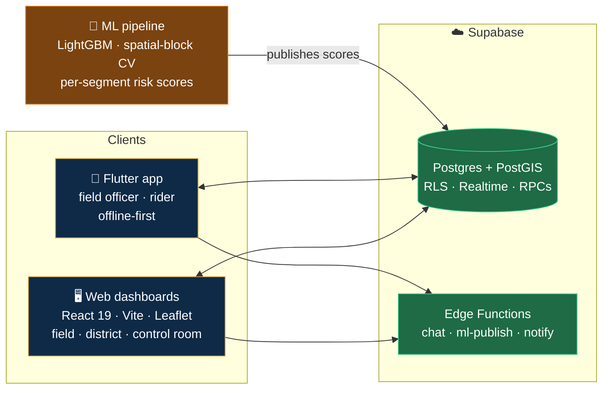

<div align="center">

# NER Logistics Platform

### Keeping India's North East moving when the mountains don't cooperate

A hazard-aware logistics command system for the North Eastern Region — one shared, live picture of incidents, shipments, routes and riders, with a machine-learning model that scores every road segment for rainfall-triggered landslide and flood risk.

[](https://binary-battalion.vercel.app)
[](docs/SRS.md)
[](LICENSE)


**[Web dashboards](NER-Website) · [Flutter app](ner_logistics) · [ML model](sih-ml) · [Backend](supabase) · [Docs](docs)**

</div>

---

## The problem

Every monsoon, the roads that hold the North East together come apart. The Siliguri corridor — the **"Chicken's Neck"**, 22 km wide at its narrowest — is the only land link between eight states and the rest of India. One landslide across it and relief convoys, fuel and food stop moving.

Today that failure is discovered *after* a truck reaches the blockage. The information exists — a field officer saw it an hour ago, the rainfall data predicted it yesterday — but it never reaches the person deciding the route.

**This platform closes that loop.**

| | |
|---|---|
| **See it** | A field officer reports a blockage from the roadside, offline if needed. It reaches the district officer and control room within seconds. |
| **Predict it** | A LightGBM model scores each road segment per day for disruption risk from rainfall, terrain and hydrology. |
| **Route around it** | Corridor accessibility and route comparison account for what's actually blocked — and riders navigate with **zero connectivity**. |

---

## How it fits together



One backend, one set of accounts, four roles. **Row Level Security in Postgres is the security boundary** — not hidden buttons. An incident reported by a field officer is scoped to their district and visible to that district's officer and the control room, enforced in the database.

---

## What's inside

| Component | Stack | What it does |
|:---|:---|:---|
| **[`NER-Website/`](NER-Website)** <br/> [→ README](NER-Website/README.md) | React 19 · Vite · Tailwind 4 · Leaflet | Dashboards for field, district and control-room roles. Incidents, tasks, alerts, routes, shipments, analytics, live rider map. **Deployed on Vercel.** |
| **[`ner_logistics/`](ner_logistics)** <br/> [→ README](ner_logistics/README.md) | Flutter · Riverpod · flutter_map | Field officer + logistics rider app. Offline incident reporting, live GPS sharing, **fully offline turn-by-turn navigation**. |
| **[`sih-ml/`](sih-ml)** <br/> [→ README](sih-ml/README.md) | LightGBM · Python · MLflow | Corridor disruption prediction. Labels from landslide/disaster catalogues, features from terrain, hydrology and CHIRPS rainfall. |
| **[`supabase/`](supabase)** | SQL · PostGIS · Deno | 20 migrations: schema, RLS policies, RPCs, district geometry. Edge Functions for the assistant, score publishing and notifications. |
| **[`docs/`](docs)** | — | Requirements, ML integration plan, Apple HIG design audits, architecture diagram. |

---

## Highlights

<table>
<tr>
<td width="33%" valign="top">

### 🛰️ Offline navigation

Routing runs **on the phone** — a pure-Dart A\* search over a compact OpenStreetMap road graph, in a background isolate. An MBTiles basemap, live position, next-turn banner, automatic re-routing and spoken directions.

Guwahati → Shillong — **97 km, routed in well under a second** in tests, with no network at all.

</td>
<td width="33%" valign="top">

### 📨 Nothing gets lost

Field reports are written to the device first, then sent when a signal returns — a durable outbox with per-entry retry and backoff.

The app says **"Saved on this device. Not sent yet."** until it genuinely lands on the server. Signing out with unsent work warns you first.

</td>
<td width="33%" valign="top">

### ♿ Built to the HIG

Both clients were audited against Apple's Human Interface Guidelines, twice.

Screen-reader labels, 44 pt targets, 200% text scaling, Reduce Motion, visible keyboard focus, and a translucent glass material with opaque fallbacks for reduced-transparency and high-contrast.

</td>
</tr>
</table>

---

## Quick start

<details>
<summary><b>🖥️ Web dashboards</b> — React + Vite</summary>

<br/>

Requires Node.js 22 and a Supabase project.

```bash
cd NER-Website
npm ci
cp .env.example .env.local     # add VITE_SUPABASE_URL + VITE_SUPABASE_PUBLISHABLE_KEY
npm run dev
```

| Variable | Required | Purpose |
|---|:---:|---|
| `VITE_SUPABASE_URL` | ✅ | Supabase project URL |
| `VITE_SUPABASE_PUBLISHABLE_KEY` | ✅ | Publishable (`sb_publishable_…`) key |
| `VITE_OSRM_URL` | — | Self-hosted OSRM. Unset falls back to the public demo server |

> [!CAUTION]
> Never put a `service_role` / secret key in a `VITE_` variable — it ships to every browser.

Full details in the [web README](NER-Website/README.md).

</details>

<details>
<summary><b>📱 Flutter app</b> — field officer + rider</summary>

<br/>

```bash
cd ner_logistics
cp env.example.json env.json          # add your Supabase URL + publishable key
flutter pub get
flutter run --dart-define-from-file=env.json

flutter analyze && flutter test       # 25 test suites
```

Only the **publishable** key ever ships in the app; RLS is the boundary.

The offline navigation pack bundled here covers the **Guwahati–Shillong corridor**. Tools to build a full-region pack live in [`ner_logistics/tool/`](ner_logistics/tool).

</details>

<details>
<summary><b>🧠 ML pipeline</b> — training and evaluation</summary>

<br/>

```bash
cd sih-ml
pip install -r requirements.txt
python -m pytest tests/ -q            # some tests need data snapshots (not in this repo)
```

Trained models and calibrators live in [`sih-ml/models/`](sih-ml/models); `registry.json` records which version is which. The serving bundle used by the inference container is in [`sih-ml/deploy/bundles/`](sih-ml/deploy/bundles).

**Method and results:** [`FINAL_MODEL.md`](sih-ml/FINAL_MODEL.md) · [`ML_ARCHITECTURE.md`](sih-ml/ML_ARCHITECTURE.md) · [`FORMULAS_AND_ALGORITHMS.md`](sih-ml/FORMULAS_AND_ALGORITHMS.md) · [`REMEDIATION.md`](sih-ml/REMEDIATION.md) · [`DEPLOYMENT.md`](sih-ml/DEPLOYMENT.md)

</details>

<details>
<summary><b>☁️ Supabase backend</b> — schema, RLS, functions</summary>

<br/>

```bash
supabase start
supabase db reset        # applies all 20 migrations
```

Accounts are real Supabase Auth accounts. **Riders are active immediately**; field, district and control-room accounts wait for approval by a district officer or the control room. The first control-room account is activated by hand:

```sql
update public.user_roles set is_active = true where user_id = '<uuid>';
```

There are no demo accounts — create one from the app's *Create account* screen.

</details>

---

## Honest notes

We would rather be trusted than impressive. Three things an evaluator should know:

> [!IMPORTANT]
> **The risk scores on screen are a replay, not a live forecast.** The dashboards currently show stored scores for 5 Aug 2025. Live scoring needs the inference container running against fresh rainfall data.

> [!WARNING]
> **Rank by `risk_percentile`, not `p_calibrated`.** Calibration was done on a case-control panel (~10 sampled negatives per positive), so the absolute probability overstates true daily risk on the full corridor — and calibration did **not** transfer cleanly to an unseen region in testing (worst terrain stratum 2.65×).

> [!NOTE]
> **Model versions differ on purpose.** `registry.json` names `final_v6` as champion and `final_v2` as release champion, while the inference bundle currently points at `final_v3`. `final_v1` is documented as leaked and superseded — see [`REMEDIATION.md`](sih-ml/REMEDIATION.md).

---

## What's deliberately not in this repo

This repository is public, so secrets, generated artifacts and very large data stay out.

<details>
<summary>The full list, and where each one comes from</summary>

<br/>

| Excluded | Why | How to get it |
|---|---|---|
| Android keystore, `key.properties`, `.env`, `env.json` | Secrets | Templates: `.env.example`, `ner_logistics/env.example.json` |
| Flutter `build/`, `node_modules`, virtualenvs | Generated (~3 GB) | `flutter build`, `npm ci`, `pip install` |
| OSRM road data (~800 MB) | Size | [`ner_logistics/backend/`](ner_logistics/backend) |
| ML raw data, feature store, score archives (>1 GB) | Size | [`sih-ml/DEPLOYMENT.md`](sih-ml/DEPLOYMENT.md) |
| MLflow runs, HPO studies | Experiment logs | Regenerated by the pipeline |

Because of this, `docker compose up` needs the OSRM data and ML feature store prepared first.

</details>

---

## Documentation

| Document | What's in it |
|:---|:---|
| [**SRS**](docs/SRS.md) | Software requirements specification for the whole platform |
| [**ML integration plan**](docs/ML_INTEGRATION_PLAN.md) | Wiring risk scores through to the clients |
| [**HIG audit**](docs/UI_AUDIT_APPLE_HIG.md) → [**re-audit**](docs/UI_AUDIT_APPLE_HIG_V2.md) | 34 findings, then what got fixed and what didn't |
| [**Architecture diagram**](docs/architecture) | Interactive system diagram — open `index.html` |

---

<div align="center">

**Built for MDoNER · Smart India Hackathon 2026 · SIH26002**

[MIT](LICENSE) © 2026 Anand Sharma

</div>
